# 修改、改进 RxGo 包
## 项目需求
阅读 ReactiveX 文档。请在 pmlpml/RxGo 基础上，
- 修改、改进它的实现
- 或添加一组新的操作，如 filtering

## 实验环境
- windows10
- go1.13

## 设计说明
### 过滤操作 filtering   
这些操作符用于从Observable发射的数据中进行选择

- Debounce — 只有在空闲了一段时间后才发射数据，通俗的说，就是如果一段时间没有操作，就执行一次操作
- Distinct — 去重，过滤掉重复数据项
- ElementAt — 取值，取特定位置的数据项
- Filter — 过滤，过滤掉没有通过谓词测试的数据项，只发射通过测试的
- First — 首项，只发射满足条件的第一条数据
- IgnoreElements — 忽略所有的数据，只保留终止通知(onError或onCompleted)
- Last — 末项，只发射最后一条数据
- Sample — 取样，定期发射最新的数据，等于是数据抽样，有的实现里叫ThrottleFirst
- Skip — 跳过前面的若干项数据
- SkipLast — 跳过后面的若干项数据
- Take — 只保留前面的若干项数据
- TakeLast — 只保留后面的若干项数据

### 过滤操作符filOperater结构定义
模仿`transforms.go`的写法
首先定义操作符
```go
// filter node implementation of streamOperator
type filOperater struct {
	opFunc func(ctx context.Context, o *Observable, item reflect.Value, out chan interface{}) (end bool)
}
```

### filOperater实现操作符的接口streamOperator
op函数从连接的前一个Observable的信道拿到数据遍历，对其中的每个数据执行操作符函数`ftop.opFunc(ctx, o, xv, out)`    
在数据遍历终止以后发射缓存中的数据。     
如果开启调度器，则执行相关操作。注意需要等待调度器go程结束后才关闭输出信道。    
```go
type streamOperator interface {
	op(ctx context.Context, o *Observable)
}

func (ftop filOperater) op(ctx context.Context, o *Observable) {
	// must hold defintion of flow resourcs here, such as chan etc., that is allocated when connected
	// this resurces may be changed when operation routine is running.
	in := o.pred.outflow
	out := o.outflow
	//fmt.Println(o.name, "operator in/out chan ", in, out)
	var wg sync.WaitGroup
	if o.computation{	
		wg.Add(1)
		go func(){
			defer wg.Done()
			for o.computation{
				select {
				case <-ctx.Done():
					return
				case <-time.After(o.timespan):
					if o.flip!=nil{
						buffer,_:=o.flip.([]interface{})//通过断言实现类型转换
						for _,v := range buffer{
							o.sendToFlow(ctx, v, out)
						}
						o.flip=nil
					}
				}
			}	
		}()	
	}
	go func() {
		end := false
		for x := range in {
			if end {
				continue
			}
			// can not pass a interface as parameter (pointer) to gorountion for it may change its value outside!
			xv := reflect.ValueOf(x)
			// send an error to stream if the flip not accept error
			if e, ok := x.(error); ok && !o.flip_accept_error {
				o.sendToFlow(ctx, e, out)
				continue
			}
			// scheduler
			switch threading := o.threading; threading {
			case ThreadingDefault:
				if ftop.opFunc(ctx, o, xv, out) {
					end = true
				}
			case ThreadingIO:
				fallthrough
			case ThreadingComputing:
				wg.Add(1)
				go func() {
					defer wg.Done()
					if ftop.opFunc(ctx, o, xv, out) {
						end = true
					}
				}()
			default:
			}
		}
		o.computation=false
		
		wg.Wait() //waiting all go-routines completed
		if o.flip!=nil{
			buffer,_:=o.flip.([]interface{})//通过断言实现类型转换
			for _,v := range buffer{
				o.sendToFlow(ctx, v, out)
			}
		}		
		o.closeFlow(out)
	}()
}
```

### 实现具体的操作符函数
#### Filter
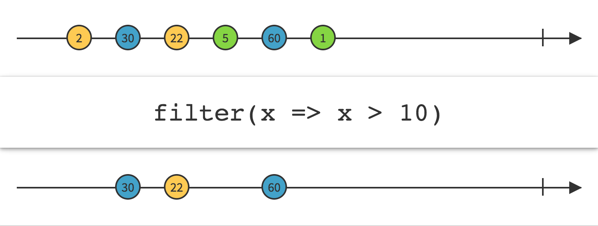   
只发射通过了谓词测试的数据项。     
`Filter`操作符使用你指定的一个谓词函数测试数据项，只有通过测试的数据才会被发射。   
此函数已在`transforms.go`中实现，其余函数的实现参考此函数。    
```go
// Filter `func(x anytype) bool` filters items in the original Observable and returns
// a new Observable with the filtered items.
func (parent *Observable) Filter(f interface{}) (o *Observable) {
	// check validation of f
	fv := reflect.ValueOf(f)
	inType := []reflect.Type{typeAny}
	outType := []reflect.Type{typeBool}
	b, ctx_sup := checkFuncUpcast(fv, inType, outType, true)
	if !b {
		panic(ErrFuncFlip)
	}

	o = parent.newTransformObservable("filter")
	o.flip_accept_error = checkFuncAcceptError(fv)

	o.flip_sup_ctx = ctx_sup
	o.flip = fv.Interface()
	o.operator = filterOperater
	return o
}
```

#### Debounce
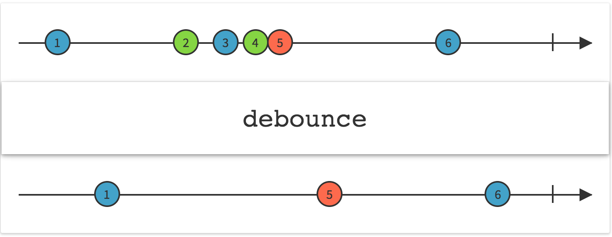
仅当一段时间内只有一个数据发射时才发射数据，如果计时时间内有新的数据到达(`latest`不是当前要发送的数据)则不发射,在新到达的数据处重新开始计时。   
`Debounce`操作符过滤掉发射速率过快的数据项。
```go
func (parent *Observable) Debounce(timespan time.Duration) (o *Observable) {
	o = parent.newTransformObservable("debounce")
	
	var latest interface{}
	o.operator  = filOperater{func(ctx context.Context, o *Observable, x reflect.Value, out chan interface{}) (end bool) {
		latest=x.Interface()
		go func() {
			for{
				select {
				case <-ctx.Done():
					return
				case <-time.After(timespan):
					if latest==x.Interface() {
						o.sendToFlow(ctx, x.Interface(), out)
						return 
					}
				}
			}
		}()
			
		return
	}}
	return o
}
```


#### Distinct
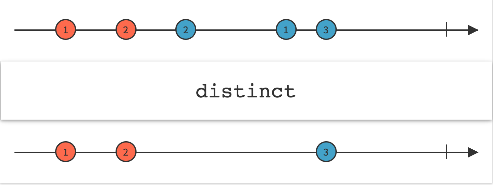
`Distinct` 操作符抑制（过滤掉）重复的数据项。   
使用一个数组存储数据项，只发射数组中不存在的数据项，并在发射后将该数据项加入数组。
```go
func (parent *Observable) Distinct() (o *Observable) {
	o = parent.newTransformObservable("distinct")

	var slice []interface{}
	o.operator  = filOperater{func(ctx context.Context, o *Observable, x reflect.Value, out chan interface{}) (end bool) {
		flag := true
        for i := range slice{
            if x.Interface() == slice[i] {
                flag = false  // 存在重复元素，标识为false
                break
            }
        }
        if flag {  // 标识为false，不添加进结果
			o.sendToFlow(ctx, x.Interface(), out)
            slice = append(slice, x.Interface())

        }
		return
	}}
	return o
}
```

#### ElementAt
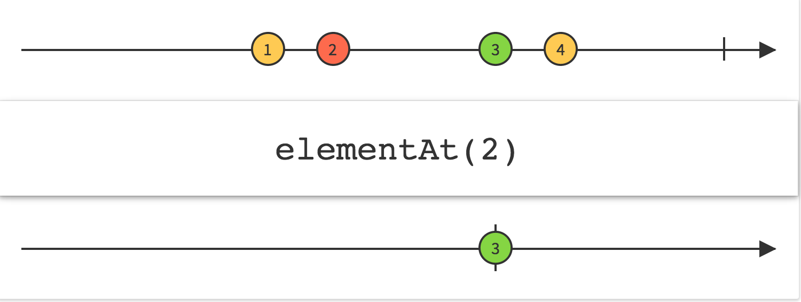
只发射第N项数据。   
用一个`takeCount`计数到达的数据数，在第N个数据到达时发射它,然后发射完成通知，忽略剩余的数据。      
实现基于0的索引值。
```go
func (parent *Observable) ElementAt(index int) (o *Observable) {
	o = parent.newTransformObservable("elementat")

	takeCount := 0
	o.operator  = filOperater{func(ctx context.Context, o *Observable, x reflect.Value, out chan interface{}) (end bool) {
		if takeCount==index {
			o.sendToFlow(ctx, x.Interface(), out)
			return true
		}
		takeCount++
		return
	}}
	return o
}

```

#### First
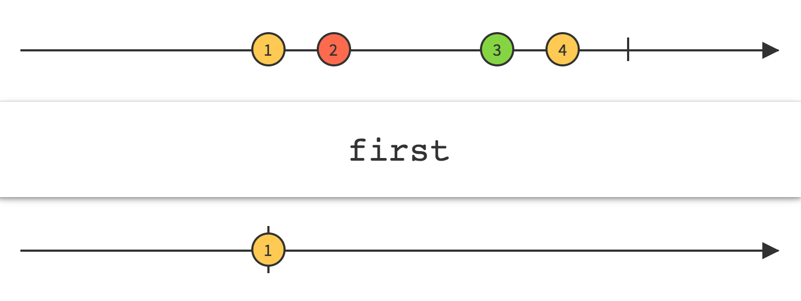
只发射第一项数据，然后发射完成通知，忽略剩余的数据。
```go
func (parent *Observable) First() (o *Observable) {
	o = parent.newTransformObservable("first")

	o.operator  = filOperater{func(ctx context.Context, o *Observable, x reflect.Value, out chan interface{}) (end bool) {
		o.sendToFlow(ctx, x.Interface(), out)
		return true
	}}
	return o
}
```

#### IgnoreElements
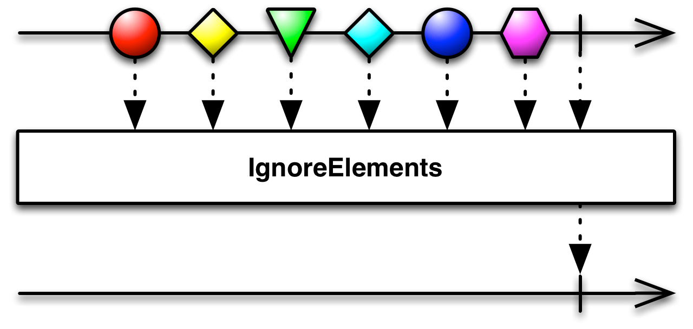
`IgnoreElements`操作符抑制原始Observable发射的所有数据。   
在函数中表现为不进行任何发射动作直接返回。
```go
func (parent *Observable) IgnoreElements() (o *Observable) {
	o = parent.newTransformObservable("ignoreElements")

	o.operator  = filOperater{func(ctx context.Context, o *Observable, x reflect.Value, out chan interface{}) (end bool) {
		return
	}}
	return o
}
```

#### Last
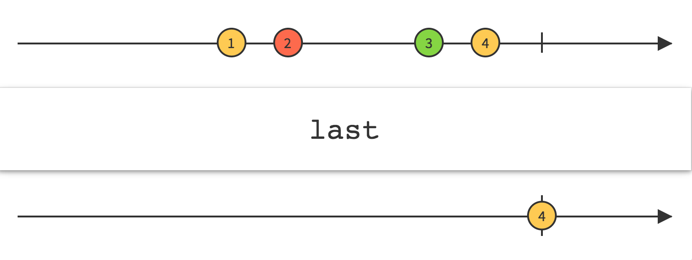
只发射最后一项数据。
使用缓存，缓存当前最后发送的一项数据，在数据处理终止以后(op函数中)发射缓存中的数据。
```go
func (parent *Observable) Last() (o *Observable) {
	o = parent.newTransformObservable("last")

	o.operator  = filOperater{func(ctx context.Context, o *Observable, x reflect.Value, out chan interface{}) (end bool) {
		var slice []interface{}
		o.flip=append(slice,x.Interface())
		return 
	}}
	return o
}
```

#### Sample
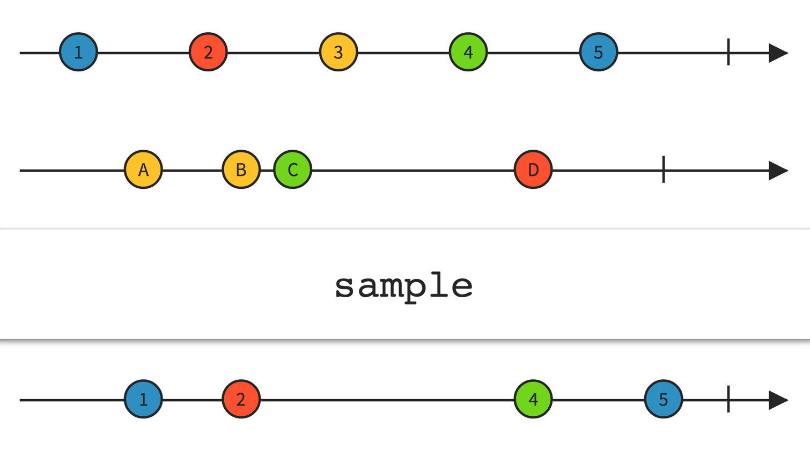
`Sample`操作符定时查看一个Observable，然后发射自上次采样以来它最近发射的数据。
在缓存中保存最新到达的数据，开启调度器，设置查看Observable并发射数据的时间间隔。
```go
func (parent *Observable) Sample(timespan time.Duration) (o *Observable) {
	o = parent.newTransformObservable("sample")
	o.computation = true
	o.timespan = timespan
	o.operator  = filOperater{func(ctx context.Context, o *Observable, x reflect.Value, out chan interface{}) (end bool) {
		var slice []interface{}
		o.flip=append(slice,x.Interface())
		return
	}}
	return o
}
```

在`Observable`的结构体定义中增加如下字段
```go
	computation bool //调度器
	timespan time.Duration  //时间间隔
```
在函数op中添加对调度器的处理
新开一个go程，定时从缓存中取出数据发射（如果缓存不为空），并将缓存清空。
```go
	if o.computation{	
		go func(){
			for {
				select {
				case <-ctx.Done():
					return
				case <-time.After(o.timespan):
					if o.flip!=nil{
						buffer,_:=o.flip.([]interface{})//通过断言实现类型转换
						for _,v := range buffer{
							o.sendToFlow(ctx, v, out)
						}
						o.flip=nil
					}
				}
			}	
		}()	
	}
```

#### Skip
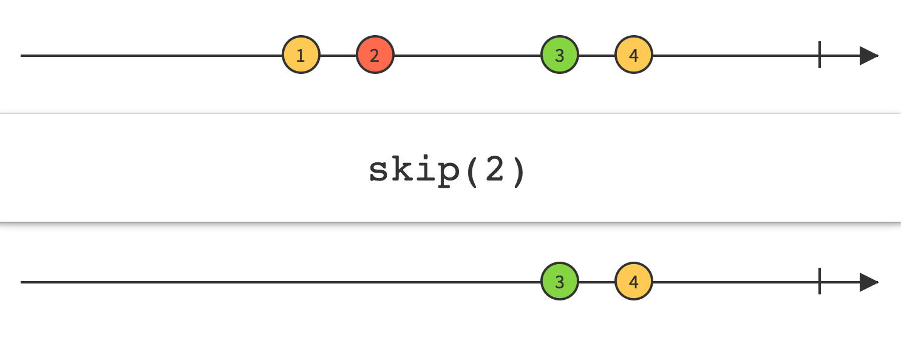
`Skip`操作符忽略Observable发射的前N项数据，只保留之后的数据。
使用一个skipCount计数，已到达的数据项个数skipCount>N时，发射数据。
```go
func (parent *Observable) Skip(n int) (o *Observable) {
	o = parent.newTransformObservable("skip")
	skipCount:=0
	o.operator  = filOperater{func(ctx context.Context, o *Observable, x reflect.Value, out chan interface{}) (end bool) {
		skipCount++;
		if skipCount>n{
			o.sendToFlow(ctx, x.Interface(), out)
		}
		return
	}}
	return o
}
```
#### SkipLast
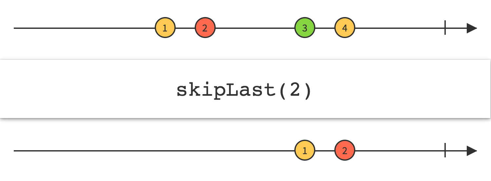
`SkipLast`忽略Observable'发射的后N项数据，只保留前面的数据。
使用缓存，缓存除后N项数据前面的数据，在数据处理终止以后(op函数中)发射缓存中的数据。
```go
func (parent *Observable) SkipLast(n int) (o *Observable) {
	o = parent.newTransformObservable("skipLast")
	var slice []interface{}
	o.operator  = filOperater{func(ctx context.Context, o *Observable, x reflect.Value, out chan interface{}) (end bool) {
		slice=append(slice,x.Interface())
		if len(slice)>n{
			o.flip=slice[0:len(slice)-n]
		} 		
		return 
	}}
	return o
}
```

#### Take
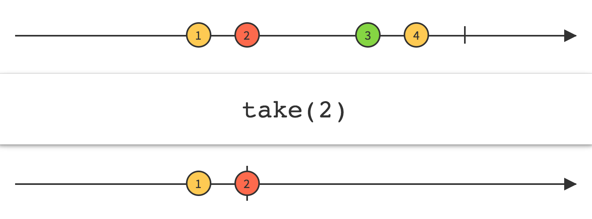
只发射前面的N项数据，然后发射完成通知，忽略剩余的数据。
用一个takeCount计数到达的数据数，发射前N个数据，在第N+1个数据到达时发射完成通知，忽略剩余的数据。    
```go
func (parent *Observable) Take(n int) (o *Observable) {
	o = parent.newTransformObservable("take")
	takeCount :=0
	o.operator  = filOperater{func(ctx context.Context, o *Observable, x reflect.Value, out chan interface{}) (end bool) {
		takeCount++
		if takeCount>n {return true}
		o.sendToFlow(ctx, x.Interface(), out)
		return
	}}
	return o
}
```
#### TakeLast
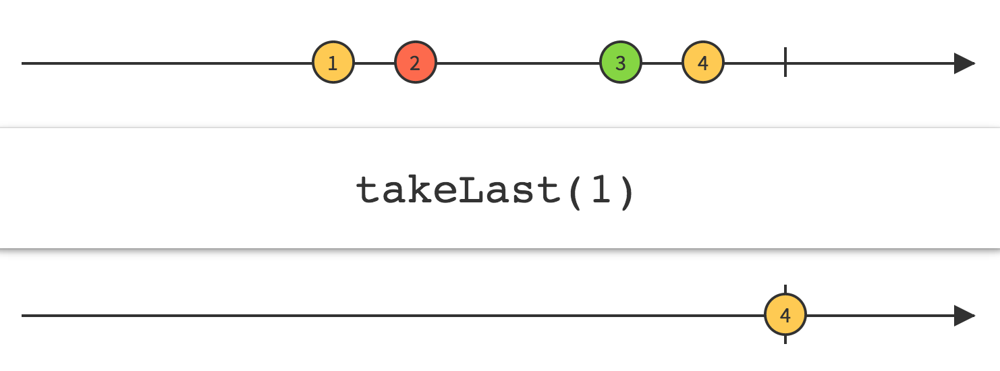
发射Observable发射的最后N项数据
使用缓存，缓存后N项数据,在数据处理终止以后(op函数中)发射缓存中的数据。
```go
func (parent *Observable) TakeLast(n int) (o *Observable) {
	o = parent.newTransformObservable("takeLast")

	var slice []interface{}
	o.operator  = filOperater{func(ctx context.Context, o *Observable, x reflect.Value, out chan interface{}) (end bool) {
		slice=append(slice,x.Interface())
		if len(slice)<n{
			o.flip=slice
		}else{
			o.flip=slice[len(slice)-n:len(slice)]
		} 		
		return 
	}}
	return o
}

```

## 单元测试
```go
package rxgo

import (
	"testing"
	"github.com/stretchr/testify/assert"
	"time"
)

func TestDebounce(t *testing.T) {
	res := []int{}
	Just(1,2,3,4,5,6).Map(func(x int) int {
		switch x {
		case 1:
			time.Sleep(0 * time.Millisecond)
		case 2:
			time.Sleep(260 * time.Millisecond)
		case 3:
			time.Sleep(300 * time.Millisecond)
		case 4:
			time.Sleep(100 * time.Millisecond)
		case 5:
			time.Sleep(260 * time.Millisecond)
		case 6:
			time.Sleep(50 * time.Millisecond)
		}
		return x
	}).Debounce(250 * time.Millisecond).Subscribe(func(x int) {
		res = append(res, x)
	})

	assert.Equal(t, []int{1,2,4}, res, "Debounce Test Error!")
}

func TestDistinct(t *testing.T) {
	res := []int{}
	Just(1, 2, 1, 1, 2, 3, 4, 4).Distinct().Subscribe(func(x int) {
		res = append(res, x)
	})
	assert.Equal(t, []int{1, 2, 3, 4}, res, "Distinct Test Error!")
}

func TestElementAt(t *testing.T) {
	res := []int{}
	for i:=0;i<6;i++{
		Just(18,12,21,33,15,66).ElementAt(i).Subscribe(func(x int) {
			res = append(res, x)
		})
	}

	assert.Equal(t, []int{18,12,21,33,15,66}, res, "Distinct Test Error!")
}

func TestFirst(t *testing.T) {
	res := []int{}
	Just(18,12,21,33,15,66).First().Subscribe(func(x int) {
		res = append(res, x)
	})

	assert.Equal(t, []int{18}, res, "Distinct Test Error!")
}

func TestIgnoreElements(t *testing.T) {
	res := []int{}
	Just(18,12,21,33,15,66).IgnoreElements().Subscribe(func(x int) {
		res = append(res, x)
	})

	assert.Equal(t, []int{}, res, "IgnoreElements Test Error!")
}

func TestLast(t *testing.T) {
	res := []int{}
	Just(18,12,21,33,15,66).Last().Subscribe(func(x int) {
		res = append(res, x)
	})

	assert.Equal(t, []int{66}, res, "Last Test Error!")
}

func TestSample(t *testing.T) {
	res := []int{}
	Just(1,2,3,4,5,6).Map(func(x int) int {
		switch x {
		case 1:
			time.Sleep(0 * time.Millisecond)
		case 2:
			time.Sleep(10 * time.Millisecond)
		case 3:
			time.Sleep(5 * time.Millisecond)
		case 4:
			time.Sleep(20 * time.Millisecond)
		case 5:
			time.Sleep(20 * time.Millisecond)
		case 6:
			time.Sleep(50 * time.Millisecond)
		}
		return x
	}).Sample(25 * time.Millisecond).Subscribe(func(x int) {
		res = append(res, x)
	})

	assert.Equal(t, []int{3,4,5,6}, res, "Sample Test Error!")
}


func TestSkip(t *testing.T) {
	res := []int{}
	Just(18,12,21,33,15,66).Skip(3).Subscribe(func(x int) {
		res = append(res, x)
	})

	assert.Equal(t, []int{33,15,66}, res, "Skip Test Error!")
}

func TestSkipLast(t *testing.T) {
	res := []int{}
	Just(18,12,21,33,15,66).SkipLast(3).Subscribe(func(x int) {
		res = append(res, x)
	})

	assert.Equal(t, []int{18,12,21}, res, "SkipLast Test Error!")
}

func TestTake(t *testing.T) {
	res := []int{}
	Just(18,12,21,33,15,66).Take(2).Subscribe(func(x int) {
		res = append(res, x)
	})

	assert.Equal(t, []int{18,12}, res, "Take Test Error!")
}

func TestTakeLast(t *testing.T) {
	res := []int{}
	Just(18,12,21,33,15,66).TakeLast(2).Subscribe(func(x int) {
		res = append(res, x)
	})

	assert.Equal(t, []int{15,66}, res, "TakeLast Test Error!")
}


```
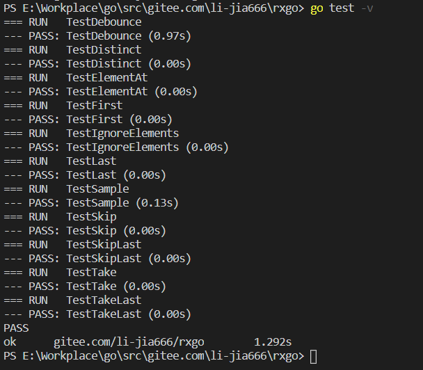

## 功能测试结果

```go
package main

import (
	"fmt"
	"time"
	RxGo "gitee.com/li-jia666/rxgo"
)


func main() {
    fmt.Println("Debounce:")
    RxGo.Just(1,2,3,4,5,6).Map(func(x int) int {
		switch x {
		case 1:
			time.Sleep(0 * time.Millisecond)
		case 2:
			time.Sleep(250 * time.Millisecond)
		case 3:
			time.Sleep(300 * time.Millisecond)
		case 4:
			time.Sleep(100 * time.Millisecond)
		case 5:
			time.Sleep(260 * time.Millisecond)
		case 6:
			time.Sleep(50 * time.Millisecond)
		}
		return x
	}).Debounce(250 * time.Millisecond).Subscribe(func(x int) {
		fmt.Print(x)
    })
    fmt.Println()

    fmt.Println("Distinct:")
    RxGo.Just(1, 2, 1, 1, 2, 3, 4, 4).Distinct().Subscribe(func(x int) {
		fmt.Print(x)
    })
    fmt.Println()

    fmt.Println("ElementAt:")
        for i:=0;i<6;i++{
            RxGo.Just(18,12,21,33,15,66).ElementAt(i).Subscribe(func(x int) {
                fmt.Printf("%d:%d\n",i,x)
            })
        }
    fmt.Println()

    fmt.Println("First:")
    RxGo.Just(18,12,21,33,15,66).First().Subscribe(func(x int) {
            fmt.Print(x)
        })
    fmt.Println()
    
    fmt.Println("IgnoreElements:")
    RxGo.Just(18,12,21,33,15,66).IgnoreElements().Subscribe(func(x int) {
            fmt.Print(x)
        })
    fmt.Println()
    
    fmt.Println("Last:")
    RxGo.Just(18,12,21,33,15,66).Last().Subscribe(func(x int) {
            fmt.Print(x)
        })
    fmt.Println()

    fmt.Println("Sample:")
    RxGo.Just(1,2,3,4,5,6).Map(func(x int) int {
                switch x {
                case 1:
                    time.Sleep(0 * time.Millisecond)
                case 2:
                    time.Sleep(10 * time.Millisecond)
                case 3:
                    time.Sleep(5 * time.Millisecond)
                case 4:
                    time.Sleep(20 * time.Millisecond)
                case 5:
                    time.Sleep(20 * time.Millisecond)
                case 6:
                    time.Sleep(50 * time.Millisecond)
                }
                return x
            }).Sample(25 * time.Millisecond).Subscribe(func(x int) {
                fmt.Print(x)
            })
    fmt.Println()
    

    fmt.Println("Skip:")
    RxGo.Just(18,12,21,33,15,66).Skip(3).Subscribe(func(x int) {
            fmt.Print(x)
        })
        
    fmt.Println()

    fmt.Println("SkipLast")
    RxGo.Just(18,12,21,33,15,66).SkipLast(3).Subscribe(func(x int) {
            fmt.Print(x)
        })
    fmt.Println()


    fmt.Println("Take:")
    RxGo.Just(18,12,21,33,15,66).Take(2).Subscribe(func(x int) {
            fmt.Print(x)
        })
    fmt.Println()

    fmt.Println("TakeLast:")
    RxGo.Just(18,12,21,33,15,66).TakeLast(2).Subscribe(func(x int) {
            fmt.Print(x)
        })
    fmt.Println()
}
```

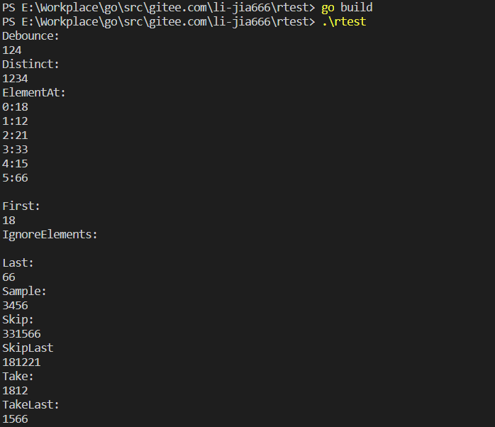

