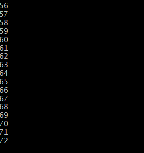
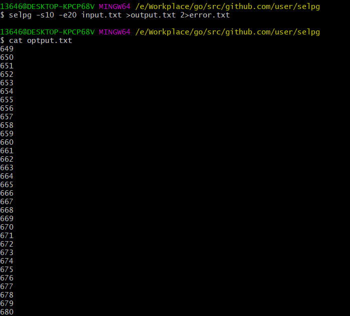
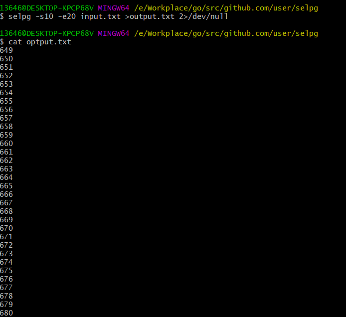

# 使用 golang 开发 Linux 命令行实用程序 中的 selpg
## 项目需求
- 请按文档 使用 selpg 章节要求测试你的程序
- 请使用 pflag 替代 goflag 以满足 Unix 命令行规范， 参考：Golang之使用Flag和Pflag
- golang 文件读写、读环境变量，请自己查 os 包
- “-dXXX” 实现，请自己查 os/exec 库，例如案例 Command，管理子进程的标准输入和输出通常使用 io.Pipe，具体案例见 Pipe
- 请自带测试程序，确保函数等功能正确

## selpg介绍  
Linux命令行实用程序selpg，全称select page。该实用程序从标准输入或从作为命令行参数给出的文件名读取文本输入。它允许用户指定来自该输入并随后将被输出的页面范围。

### 命令行参数的解析
```c
selpg [-s startPage] [-e endPage] [-l linePerPage | -f] [-d destination] input_file >output_file 2>error_file
```
强制选项：  
`-s`：startPage，后面接开始读取的页号，一个不小于1的整数
`-e`：endPage，后面接结束读取的页号，一个不小于开始页号的整数
  
可选选项：
`-l`：后面接一个整数，表示每页的行数，若无此参数（且无-f）则默认为72行
`-f`：该标志无参数，表示按分页符'\f'分页
`-d`：“-dDestination”选项将选定的页直接发送至打印机，“Destination”应该是 lp 命令“-d”选项可接受的打印目的地名称  
` input_file`，`output_file`，`error_file`：输入文件、输出文件、错误信息文件的名字  

## 实验环境

- windows10
- go1.13

## 项目依赖

- [pflag](https://github.com/spf13/pflag)

## 实验过程


### 安装依赖

```bash
go get github.com/spf13/pflag
```

### 创建并编写 selpg.go 文件

1. 导入所需包
```go
import (
	"bufio"
	"errors"
	"fmt"
	"io"
	"os"
	"os/exec"

	flag "github.com/spf13/pflag"
)
```
2. 设置全局变量
```go
var (
	startPage = flag.IntP("start_page", "s", -1, "start page")
	endPage = flag.IntP("end_page", "e", -1, "end page")
	pageLen = flag.IntP("page_len", "l", 72, "line number per page")
	pageBreak = flag.BoolP("use_page_break", "f", false, "pages devided by page break \\f")
	printDest = flag.StringP("print_dest", "d", "", "specify the printer")
	pageType string
)
```
3. main函数
```go
func main() {
  handleError(parseArgs())
  handleError(readAndPrint())
}

```

4. 实现各个函数的功能
```go
parseArgs() //解析参数,并检查输入的参数是否有效
readAndWrite()	//读取文件并将结果输出
printUsage() // 打印使用方法
handleError(err error) // 错误处理
```

- parseArgs()
```go
func parseArgs() error {
	flag.Parse() // 使用pflag提供的方法解析命令行参数

	if *pageBreak { // 判断文件分页格式
		pageType = "f"
	} else {
		pageType = "l"
	}

	if *startPage == -1 || *endPage == -1 { // 判断参数是否完整（起始页和结束页）
		printUsage()
		return errors.New("The arguments are not enough")
	}

	if *startPage <= 0 || *endPage <= 0 { // 判断页码是否合理
		return errors.New("The page number can not be negative")
	}

	if *startPage > *endPage { // 判断页码是否合理
		return errors.New("The start page cannot be greater than end page")
	}

	if pageType == "l" && *pageLen <= 0 { // 判断页长是否合理
		return errors.New("The line number per page can not be negative")
	}

	if pageType == "f" && *pageLen != 72 { // 判断是否同时设置两种分页格式
		return errors.New("-f and -l linePerPage cannot be set at the same time")
	}

	return nil
}
```

- readAndWrite()

```go
func readAndWrite() error {
	var reader *bufio.Reader // 定义一个输入流
	var writer *bufio.Writer // 定义一个输出流

	if flag.NArg() == 0 { // 根据[FILE]参数给输入流赋值
		reader = bufio.NewReader(os.Stdin)
	} else {
		input, err := os.Open(flag.Arg(0))
		if err != nil {
			return err
		}
		defer input.Close()
		reader = bufio.NewReader(input)
	}

	if len(*printDest) == 0 { // 根据-d参数给输出流赋值
		writer = bufio.NewWriter(os.Stdout)
	} else {
		cmd := exec.Command("lp", "-d"+*printDest)
		output, err := cmd.StdinPipe()
		if err != nil {
			return err
		}
		defer output.Close()
        cmd.Stdout = os.Stdout
        cmd.Stderr = os.Stderr
		if err := cmd.Start(); err != nil {
			return err
		}
		writer = bufio.NewWriter(output)
	}
	defer writer.Flush()

	var pageSpliter byte // 获取分页格式标识符
	if pageType == "f" {
		pageSpliter = '\f'
	} else {
		pageSpliter = '\n'
	}

	pages, lines := 1, 0
	for {
		sub, err := reader.ReadBytes(pageSpliter) // 根据标识符读取一段内容
		if err == io.EOF {
			break
		} else if err != nil {
			return err
		}
		if pageType == "f" { // 进行行/页相应处理
			pages++
		} else {
			lines++
			if lines > *pageLen {
				lines = 1
				pages++
			}
		}
		if pages >= *startPage && pages <= *endPage {
			if _, err := writer.Write(sub); err != nil {
				return err
			}
		} else if pages > *endPage{
			break
		}
	}

	return nil
}
```

- printUsage()

```go
func printUsage() { 
	fmt.Fprintln(os.Stderr, "Usage: selpg [-s startPage] [-e endPage] [-l linePerPage | -f] [-d destination] input_file >output_file 2>error_file")
	flag.PrintDefaults()
	os.Exit(2)
}
```
- handleError(err error)

```go
func handleError(err error) {
	if err != nil {
		if _, err2 := fmt.Fprintf(os.Stderr, "%s\n", err.Error()); err2 != nil {
			panic(err2)
		}
		os.Exit(1)
	}
}
```

### 编译执行

```bash
go build
go install
selpg
```


### 程序测试
input.txt输入文件总共1800行，依次为1到1800

#### 1 $ selpg -s1 -e1 input_file
```selpg -s1 -e1 input.txt```

该命令将把“input_file”的第 1 页写至标准输出。



打印1-72
(下面只截图前面部分)
#### 2 $ selpg -s1 -e1 < input_file
```selpg -s1 -e1 < input.txt```
该命令与示例 1 所做的工作相同，但在本例中，selpg 读取标准输入，而标准输入已被 shell／内核重定向为来自“input_file”而不是显式命名的文件名参数。输入的第 1 页被写至屏幕。


打印1-72

#### 3 $ other_command | selpg -s10 -e20
```cat input.txt | selpg -s10 -e20```

“other_command”的标准输出被 shell／内核重定向至 selpg 的标准输入。将第 10 页到第 20 页写至 selpg 的标准输出（屏幕）。


中间省略


打印649-1440
(下面只截图前面部分)
#### 4 $ selpg -s10 -e20 input_file >output_file
```selpg -s10 -e20 input.txt > optput.txt```

selpg 将第 10 页到第 20 页写至标准输出；标准输出被 shell／内核重定向至“output_file”。
```cat optput.txt```

打印649-1440

#### 5 $ selpg -s10 -e20 input_file 2>error_file
```selpg -s10 -e20 input.txt 2> error.txt```
selpg 将第 10 页到第 20 页写至标准输出（屏幕）；所有的错误消息被 shell／内核重定向至“error_file”。请注意：在“2”和“>”之间不能有空格；这是 shell 语法的一部分（请参阅“man bash”或“man sh”）。


暂时没有错误，创建了error空白文件

#### 6 $ selpg -s10 -e20 input_file >output_file 2>error_file
```selpg -s10 -e20 input.txt >output.txt 2>error.txt```  
selpg 将第 10 页到第 20 页写至标准输出，标准输出被重定向至“output_file”；selpg 写至标准错误的所有内容都被重定向至“error_file”。当“input_file”很大时可使用这种调用；您不会想坐在那里等着 selpg 完成工作，并且您希望对输出和错误都进行保存。



#### 7 $ selpg -s10 -e20 input_file >output_file 2>/dev/null
```selpg -s10 -e20 input.txt >output.txt 2>/dev/null ``` 
selpg 将第 10 页到第 20 页写至标准输出，标准输出被重定向至“output_file”；selpg 写至标准错误的所有内容都被重定向至 /dev/null（空设备），这意味着错误消息被丢弃了。设备文件 /dev/null 废弃所有写至它的输出，当从该设备文件读取时，会立即返回 EOF。



#### 8 $ selpg -s10 -e20 input_file >/dev/null
```selpg -s10 -e20 input.txt >/dev/null ``` 

selpg 将第 10 页到第 20 页写至标准输出，标准输出被丢弃；错误消息在屏幕出现。这可作为测试 selpg 的用途，此时您也许只想（对一些测试情况）检查错误消息，而不想看到正常输出。


#### 9 $ selpg -s10 -e20 input_file | other_command
```selpg -s10 -e20 input.txt | selpg -s1 -e2 ``` 

selpg 的标准输出透明地被 shell／内核重定向，成为“other_command”的标准输入，第 10 页到第 20 页被写至该标准输入。“other_command”的示例可以是 lp，它使输出在系统缺省打印机上打印。“other_command”的示例也可以 wc，它会显示选定范围的页中包含的行数、字数和字符数。“other_command”可以是任何其它能从其标准输入读取的命令。错误消息仍在屏幕显示。


中间省略


相当于原文件的10-11页
(下面只截图前面部分)

#### 10 $ selpg -s10 -e20 input_file 2>error_file | other_command
```selpg -s10 -e20 input.txt 2>error.txt | selpg -s1 -e2 ``` 

与上面的示例 9 相似，只有一点不同：错误消息被写至“error_file”。


#### 11 $ selpg -s10 -e20 -l66 input_file
```selpg -s10 -e20 -l66 input.txt ``` 

该命令将页长设置为 66 行，这样 selpg 就可以把输入当作被定界为该长度的页那样处理。第 10 页到第 20 页被写至 selpg 的标准输出（屏幕）。


中间省略


#### 12 $ selpg -s2 -e3 -f input_file  
```selpg -s1 -e1 -f finput.txt ``` 
假定页由换页符定界。第 2 页到第 3 页被写至 selpg 的标准输出（屏幕）。

#### 13 $ selpg -s10 -e20 -dlp1 input_file
```selpg -s10 -e20 -dlp1 input.txt ``` 
第 10 页到第 20 页由管道输送至命令“lp -dlp1”，该命令将使输出在打印机 lp1 上打印。

#### 14 $ selpg -s10 -e20 input_file > output_file 2>error_file &
```selpg -s10 -e20 input.txt > output.txt 2>error.txt & ``` 
该命令利用了 Linux 的一个强大特性，即：在“后台”运行进程的能力。可以通过运行命令 ps（代表“进程状态”）检查它是否仍在运行或已经完成。
```ps ``` 

