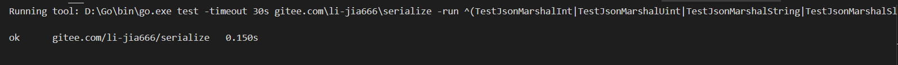
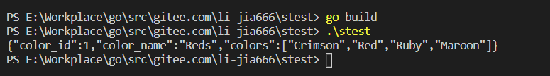

# 对象序列化支持包开发
## 项目需求
1. 参考官方 encoding/json 包 Marshal 函数，将结构数据格式化为 json 字符流
- 必须导出 `func JsonMarshal(v interface{}) ([]byte, error)`
- 可以参考、甚至复制原来的代码
- 支持字段的标签（Tag），标签满足`mytag:"你自己的定义"`
- 不允许使用第三方包
2. 包必须包括以下内容：
- 生成的中文 api 文档
- 有较好的 Readme 文件，包括一个简单的使用案例
- 每个go文件必须有对应的测试文件

## 实验环境
- windows10
- go1.13

## 设计说明
将一个对象写成特定文本格式(json)的字符流，称为序列化。

### 标签（Tag）
`type StructTag string`
结构体字段中的标签
`func (tag StructTag) Get(key string) string`
Get方法返回标签字符串`key:"value"`对中键key对应的值。如果标签中没有该键，会返回""。如果标签不符合标准格式，Get的返回值是不确定的。
```go
const tagName = "mytag"
//获取字段标签
t := reflect.TypeOf(input)//动态获取输入参数接口中的值的类型
field := t.Field(i)//通过reflect.Type的Field获取其字段
tag := field.Tag.Get(tagName)//传入标签名获得字段标签
//定义字段标签
type ColorGroup struct {
	ID     int	`mytag:"color_id"`
	Name   string	`mytag:"color_name"`
	Colors []string	`mytag:"colors"`
}
```

### JsonMarshal函数
#### reflect包 
reflect包实现了运行时反射，允许程序操作任意类型的对象。
典型用法是用静态类型interface{}保存一个值，
通过调用TypeOf获取其动态类型信息，该函数返回一个Type类型值。
调用ValueOf函数返回一个Value类型值，该值代表运行时的数据。

#### 处理两类数据
- 基本类型（int，uint，string）
转化为符合json格式要求的的字符串（使用strconv包），存储在byte数组
```go
func marshalInt(input interface{}) []byte {
	s := strconv.FormatInt(reflect.ValueOf(input).Int(), 10)
	return []byte(s)
}
```
- 结构体/数组
对其中的每个字段/元素递归调用此函数，返回的结果以一定格式组织
```go
func marshalArray(input interface{}) ([]byte, error) {
	result := []byte{'['}
	v := reflect.ValueOf(input)
	for i := 0; i < v.Len(); i++ {
		res, err := JsonMarshal(v.Index(i).Interface())
		if err != nil {
			return nil, err
		}
		result = append(result, res...)
		if i!=v.Len()-1{
			result = append(result, ',')
		}
	}
		result = append(result, ']')
	return result, nil
}
```

#### 结构体：通过接口遍历未知类型的字段
1. 先获取interface的reflect.Type，然后通过struct类型的字段数NumField进行遍历
`t := reflect.TypeOf(input)`
`for i := 0; i < t.NumField(); i++`
2. 再通过reflect.Value的Field获取其字段
3. 最后通过Field的Interface()转换成interface{}类型
`v := reflect.ValueOf(input)`
`res, err := JsonMarshal(v.Field(i).Interface())`

```go

func marshalStruct(input interface{}) ([]byte, error) {
	result := []byte{'{'}
	t := reflect.TypeOf(input)
	v := reflect.ValueOf(input)
	for i := 0; i < t.NumField(); i++ {
		field := t.Field(i)
		if field.PkgPath == "" {
			tag := field.Tag.Get(tagName)
			fieldName := field.Name
			if tag != "" {
				fieldName = tag
			}
			result = append(result, '"')
			result = append(result, []byte(fieldName)...)
			result = append(result, '"')
			result = append(result, ':')
			res, err := JsonMarshal(v.Field(i).Interface())
			if err != nil {
				return nil, err
			}
			result = append(result, res...)
			if i!=t.NumField()-1{
				result = append(result, ',')
			}
		}
	}
	result = append(result, '}')
	return result, nil
}
```
#### 数组：通过接口遍历未知类型的元素
1. 先获取interface的reflect.Value，然后通过array类型的长度Len进行遍历
`v := reflect.ValueOf(input)`
`for i := 0; i < v.Len(); i++`
2. 再通过reflect.Value的Index获取其元素
3. 最后通过Index的Interface()转换成interface{}类型
`res, err := JsonMarshal(v.Index(i).Interface())`

## 单元测试
测试覆盖了
- int
- uint
- 字符串
- 结构体
- 数组
- 结构体内嵌数组
- 结构体内嵌结构体
- 带标签的结构体

```go
func TestJsonMarshalInt(t *testing.T) {
	res, err := JsonMarshal(-1234)
	want:=[]byte{'-','1', '2', '3', '4'};
	if err != nil{
		t.Errorf("JsonMarshal() error = %v", err)
		return
	}
	if !reflect.DeepEqual(res, want) {
		t.Errorf("JsonMarshal() = %v, want %v", res, want)
	}
}

func TestJsonMarshalUint(t *testing.T) {
	res, err := JsonMarshal(1234)
	want:=[]byte{'1', '2', '3', '4'};
	if err != nil{
		t.Errorf("JsonMarshal() error = %v", err)
		return
	}
	if !reflect.DeepEqual(res, want) {
		t.Errorf("JsonMarshal() = %v, want %v", res, want)
	}
}

func TestJsonMarshalString(t *testing.T) {
	res, err := JsonMarshal("test")
	want:=[]byte{'"', 't', 'e', 's', 't', '"'}
	if err != nil{
		t.Errorf("JsonMarshal() error = %v", err)
		return
	}
	if !reflect.DeepEqual(res, want) {
		t.Errorf("JsonMarshal() = %v, want %v", res, want)
	}
}

func TestJsonMarshalSlice(t *testing.T) {
	res, err := JsonMarshal([]int{})
	want:=[]byte{'[', ']'}
	if err != nil{
		t.Errorf("JsonMarshal() error = %v", err)
		return
	}
	if !reflect.DeepEqual(res, want) {
		t.Errorf("JsonMarshal() = %v, want %v", res, want)
	}
}

func TestJsonMarshalSlice2(t *testing.T) {
	res, err := JsonMarshal([]int{1, -2})
	want:=[]byte{'[', '1', ',', '-', '2', ']'}
	if err != nil{
		t.Errorf("JsonMarshal() error = %v", err)
		return
	}
	if !reflect.DeepEqual(res, want) {
		t.Errorf("JsonMarshal() = %v, want %v", res, want)
	}
}

func TestJsonMarshalArray(t *testing.T) {
	res, err := JsonMarshal([0]int{})
	want:=[]byte{'[', ']'}
	if err != nil{
		t.Errorf("JsonMarshal() error = %v", err)
		return
	}
	if !reflect.DeepEqual(res, want) {
		t.Errorf("JsonMarshal() = %v, want %v", res, want)
	}
}

func TestJsonMarshalArray2(t *testing.T) {
	res, err := JsonMarshal([3]uint{1, 2, 3})
	want:=[]byte{'[', '1', ',', '2', ',', '3', ']'}
	if err != nil{
		t.Errorf("JsonMarshal() error = %v", err)
		return
	}
	if !reflect.DeepEqual(res, want) {
		t.Errorf("JsonMarshal() = %v, want %v", res, want)
	}
}

func TestJsonMarshalEmptyStruct(t *testing.T) {
	type Empty struct{}
	res, err := JsonMarshal(Empty{})
	want:=[]byte{'{', '}'}
	if err != nil{
		t.Errorf("JsonMarshal() error = %v", err)
		return
	}
	if !reflect.DeepEqual(res, want) {
		t.Errorf("JsonMarshal() = %v, want %v", res, want)
	}
}

func TestJsonMarshalUnexportedFields(t *testing.T) {
	type Private struct{ a int }
	res, err := JsonMarshal(Private{})
	want:=[]byte{'{', '}'}
	if err != nil{
		t.Errorf("JsonMarshal() error = %v", err)
		return
	}
	if !reflect.DeepEqual(res, want) {
		t.Errorf("JsonMarshal() = %v, want %v", res, want)
	}
}

func TestJsonMarshalExportedFields(t *testing.T) {
	type Public struct{ A int }
	res, err := JsonMarshal(Public{})
	want:=[]byte{'{', '"', 'A', '"', ':', '0', '}'}
	if err != nil{
		t.Errorf("JsonMarshal() error = %v", err)
		return
	}
	if !reflect.DeepEqual(res, want) {
		t.Errorf("JsonMarshal() = %v, want %v", res, want)
	}
}

func TestJsonMarshalExportedFields2(t *testing.T) {
	type Public struct{ A, B int }
	res, err := JsonMarshal(Public{})
	want:=[]byte{'{', '"', 'A', '"', ':', '0', ',', '"', 'B', '"', ':', '0', '}'}
	if err != nil{
		t.Errorf("JsonMarshal() error = %v", err)
		return
	}
	if !reflect.DeepEqual(res, want) {
		t.Errorf("JsonMarshal() = %v, want %v", res, want)
	}
}

func TestJsonMarshalMixedFields(t *testing.T) {
	type Public struct{ A, b, C int }
	res, err := JsonMarshal(Public{})
	want:=[]byte{'{', '"', 'A', '"', ':', '0', ',', '"', 'C', '"', ':', '0', '}'}
	if err != nil{
		t.Errorf("JsonMarshal() error = %v", err)
		return
	}
	if !reflect.DeepEqual(res, want) {
		t.Errorf("JsonMarshal() = %v, want %v", res, want)
	}
}


func TestJsonMarshalWithTag(t *testing.T) {
	type PublicWithTag struct {A int `mytag:"thisisA"`}
	res, err := JsonMarshal(PublicWithTag{A: 1})
	want:=[]byte{'{','"', 't', 'h', 'i','s','i','s','A','"', ':', '1', '}'}
	if err != nil{
		t.Errorf("JsonMarshal() error = %v", err)
		return
	}
	if !reflect.DeepEqual(res, want) {
		t.Errorf("JsonMarshal() = %v, want %v", res, want)
	}
}

func TestJsonMarshalInnerString(t *testing.T) {
	type O struct{ B string	}
	res, err := JsonMarshal(O{B: "test"})
	want:=[]byte{'{', '"','B','"', ':', '"', 't', 'e', 's', 't', '"', '}'}
	if err != nil{
		t.Errorf("JsonMarshal() error = %v", err)
		return
	}
	if !reflect.DeepEqual(res, want) {
		t.Errorf("JsonMarshal() = %v, want %v", res, want)
	}
}

func TestJsonMarshalInnerStruct(t *testing.T) {
	type I struct{ A int }
	type O struct{ B I }
	res, err := JsonMarshal(O{})
	want:=[]byte{'{', '"', 'B','"', ':', '{', '"','A', '"',':', '0', '}', '}'}
	if err != nil{
		t.Errorf("JsonMarshal() error = %v", err)
		return
	}
	if !reflect.DeepEqual(res, want) {
		t.Errorf("JsonMarshal() = %v, want %v", res, want)
	}
}

func TestJsonMarshalInnerArray(t *testing.T) {
	type O struct{ B []int }
	res, err := JsonMarshal(O{B: []int{1, 2}})
	want:=[]byte{'{', '"','B','"', ':', '[', '1', ',', '2', ']', '}'}
	if err != nil{
		t.Errorf("JsonMarshal() error = %v", err)
		return
	}
	if !reflect.DeepEqual(res, want) {
		t.Errorf("JsonMarshal() = %v, want %v", res, want)
	}
}
```


## 功能测试结果

```go
type ColorGroup struct {
	ID     int	`mytag:"color_id"`
	Name   string	`mytag:"color_name"`
	Colors []string	`mytag:"colors"`
}

func main() {
    group := ColorGroup{
        ID:     1,
        Name:   "Reds",
        Colors: []string{"Crimson", "Red", "Ruby", "Maroon"},
    }
    b, err := JsonMarshal(group)
    if err != nil {
        fmt.Println("error:", err)
    }
    os.Stdout.Write(b)
}
```


