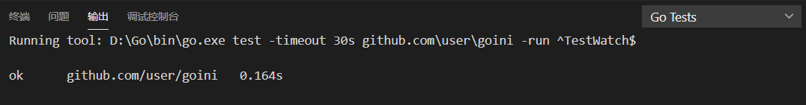
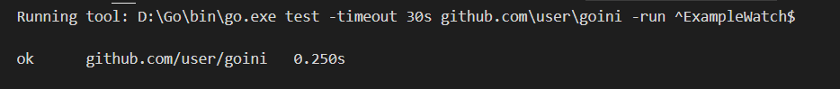
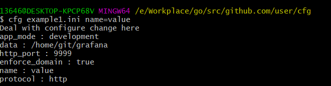
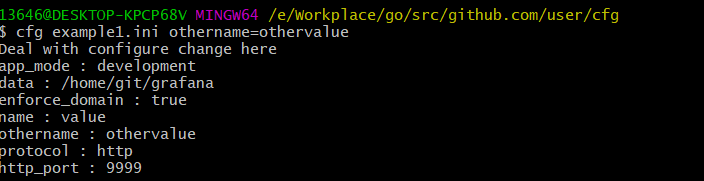
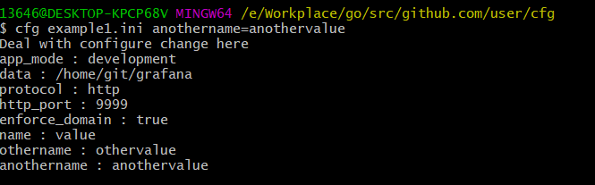

# 程序包开发，读简单配置文件 v1
## 项目需求
在 Gitee 或 GitHub 上发布一个读配置文件程序包，第一版仅需要读 ini 配置
1. 核心任务：包必须提供一个函数 `Watch(filename,listener) (configuration, error)`
- 输入 filename 是配置文件名
- 输入 listener 一个特殊的接口，用来监听配置文件是否被修改，让开发者自己决定如何处理配置变化
    - `type ListenFunc func(string)`
    - `type inteface Listener { listen(inifile string) }`
    - `ListenFunc` 实现接口方法 `listen` 直接调用函数
    - 优点
        - 所有满足签名的函数、方法都可以作为参数
        - 所有实现 Listener 接口的数据类型都可作为参数
- 输出 configuration 数据类型，可根据 key 读对应的 value。 key 和 value 都是字符串
- 输出 error 是错误数据，如配置文件不存在，无法打开等
- 可选的函数 `WatchWithOption(filename,listener,...) (configuration, error)`
2. 包必须包括以下内容：
- 生成的中文 api 文档
- 有较好的 Readme 文件，包括一个简单的使用案例
- 每个go文件必须有对应的测试文件
- 必须提供自定义错误
- 使有 init 函数，使得 Unix 系统默认采用 # 作为注释行，Windows 系统默认采用 ; 作为注释行。

## 实验环境
- windows10
- go1.13

## 设计说明
一个读配置文件程序包gini,更方便地读取go的ini配置文件

#### 自定义错误
```go
//自定义一个错误类型
type myError struct {
	etime time.Time
	info  string
}
 
//实现error接口
func (e *myError) Error() string {
	return fmt.Sprintf("time %s : %s",e.etime.Format("2006-01-02 15:04:05"),e.info)
}
```
自定义错误信息


#### Watch(filename,listener) (configuration, error)
主要使用的是`Watch`函数,该函数接收文件名以及`listener`接口作为参数，返回key-value式样的配置解析结果与自定义错误。其功能为监听自函数运行以来发生的一次配置文件变化并返回最新的配置文件解析内容。

```go
type configuration []map[string]string
func Watch(filename string,listener Listener) (configuration, error){
	listener.listen(filename) //使用方法listen监听配置文件是否被修改，如果修改，函数流程往下
	con:=GetConfig(filename) 
	err:=con.Analyse() //读文件，提取出配置信息
	var result configuration //返回一组key，values对
	for _, v := range con.conflist {
		for _, value := range v {
			result = append(result, value)
		}
	}
	return result,err
}
```
#### listener
类型`ListenFunc`实现了接口`Listener`的方法`listen`——通过监控文件状态数据中的修改时间的变化来判断文件是否被修改
```go
type Listener interface  { listen(inifile string)  }

type ListenFunc func(string)

func (l ListenFunc) listen(inifile string){
	fi, err=os.Stat(inifile)
	if err != nil {
		myerr:=&myError{time.Now(),err.Error()}
		fmt.Println(myerr.Error())
		return
	}
	modinit:=fi.ModTime().Unix()//获取文件的修改时间
	for{
		fi, err=os.Stat(inifile)
		if err != nil {
			myerr:=&myError{time.Now(),err.Error()}
			fmt.Println(myerr.Error())
			return 
		}
		mod:=fi.ModTime().Unix()
		if modinit!=mod{ //如修改时间变化，说明文件被修改，跳出循环(只监听一次变化)
			break
		}
	}
	l(inifile); //调用接收者函数，开发者在这个函数内自己决定如何处理配置变化
}
```

## 单元或集成测试结果
用于测试的配置文件
```ini
# possible values : production, development
app_mode = development

[paths]
# Path to where grafana can store temp files, sessions, and the sqlite3 db (if that is used)
data = /home/git/grafana

[server]
# Protocol (http or https)
protocol = http

# The http port  to use
http_port = 9999

# Redirect to correct domain if host header does not match domain
# Prevents DNS rebinding attacks
enforce_domain = true
```

### 单元测试
```go
func TestWatch(t *testing.T) {
	filepath:="./conf/conf.ini"
	var mylistener ListenFunc = func(inifile string) {
    }
    //修改配置文件
	var change = func(filepath string) {
		file, err := os.OpenFile(filepath, os.O_WRONLY|os.O_APPEND, 0666)
		if err != nil {
			fmt.Println("文件打开失败", err)
		}
		defer file.Close()
		write := bufio.NewWriter(file)
		write.WriteString("\r\n#注释")//加入一行注释
		write.Flush()
	}
	go change(filepath)//注释这一行则超时，必须配置文件变化才返回最新的配置文件解析内容
	conf, _ := Watch(filepath, mylistener)
	
	var testconf configuration
	var start map[string]string = make(map[string]string)
	start["app_mode"] = "development"
	var paths map[string]string = make(map[string]string)
	paths["data"] = "/home/git/grafana"
	var server map[string]string = make(map[string]string)
	server["protocol"] = "http"
	server["http_port"] = "9999"
	server["enforce_domain"] = "true"
	testconf = append(testconf, start)
	testconf = append(testconf, paths)
	testconf = append(testconf, server)

	if !reflect.DeepEqual(testconf, conf) {
		t.Errorf("expected %+v but got %+v", testconf, conf)
	}
}
```

### 示例测试
```go
func ExampleWatch() {
    filepath:="./conf/conf.ini"
    //修改配置文件
	var change = func(filepath string) {
		file, err := os.OpenFile(filepath, os.O_WRONLY|os.O_APPEND, 0666)
		if err != nil {
			fmt.Println("文件打开失败", err)
		}
		defer file.Close()
		write := bufio.NewWriter(file)
		write.WriteString("\r\n#注释")//加入一行注释
		write.Flush()
	}
	var mylistener ListenFunc =func (inifile string){
	}
	go change(filepath)//注释这一行则超时，必须配置文件变化才返回最新的配置文件解析内容
	conf,err:=Watch(filepath,mylistener)
	for _, v := range conf {
		for key,value := range v{
			fmt.Printf("%s : %s\n", key ,value)
		}
	}
	CheckErr(err)
	// Unordered output: 
	// app_mode : development 
	// data : /home/git/grafana 
	// protocol : http 
	// http_port : 9999 
	// enforce_domain : true
}
```


## 功能测试结果
在包含main函数的文件中`import "github.com/user/goini"`
```go
func main() {
	var mylistener goini.ListenFunc =func (inifile string){
		fmt.Println("Deal with configure change here")
    }
    //在配置文件中增加一行
	var add = func(filepath string,content string) {
		file, err := os.OpenFile(filepath, os.O_WRONLY|os.O_APPEND, 0666)
		if err != nil {
			fmt.Println("文件打开失败", err)
		}
		defer file.Close()
		write := bufio.NewWriter(file)
		write.WriteString("\r\n")
		write.WriteString(content)
		write.Flush()
	}
	go add(os.Args[1],os.Args[2])//注释这一行则超时，必须配置文件变化才返回最新的配置文件解析内容
	conf,err:=goini.Watch(os.Args[1],mylistener)
	goini.CheckErr(err)
	for _, v := range conf {
		for key,value := range v{
			fmt.Printf("%s : %s\n", key ,value)
		}
	}
}
```
编译并安装
```go
go build
go install
```
#### test1

可以看到新加入的 name = value 行已成功解析
#### test2

可以看到新加入的 othername = othervalue 行已成功解析
#### test3

可以看到新加入的 anothername = anothervalue 行已成功解析